# Analog Bandgap Workshop


## Overview

Today’s Systems-on-Chip (SoCs) integrate a wide variety of analog and digital blocks, each with its own specific power requirements. To ensure every block operates reliably and efficiently, the chip must generate multiple stable supply voltages. This is typically achieved using linear voltage regulators (LDOs), which deliver clean, low-noise voltage rails.

A key part of any LDO is its reference voltage (Vref). For the regulator to maintain a stable output, Vref must remain constant regardless of process variations, supply voltage changes, or temperature fluctuations—often referred to collectively as PVT.

To achieve this, modern SoCs rely on PVT-independent biasing circuits, which generate the stable reference voltage and also provide bias currents for the analog and digital blocks across the chip. These circuits are foundational to ensuring predictable, high-performance operation in today’s complex semiconductor designs.

<p align="center">
  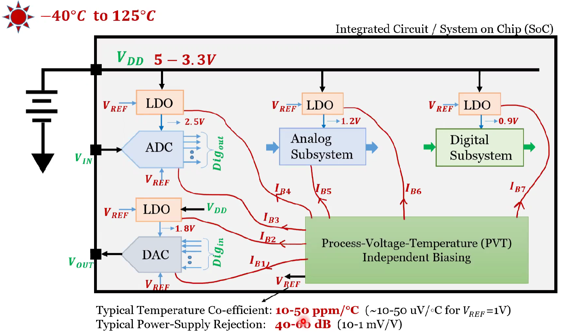
</p>
<p style="text-align:center; font-size:14px; color:#777;">
  Figure 1: Label for the image
</p>

## Various Methods to Generate Vref

### Voltage Divider

One of the simplest ways to generate a reference voltage (Vref) is to use a voltage divider connected to the power supply. When the divider is built from resistors that share the same temperature coefficient, the ratio between them remains constant as temperature changes. As a result, the output voltage stays remarkably stable—the temperature effects on each resistor effectively cancel out.

The temperature coefficient tells you how much a device’s behavior changes with temperature. It is usually expressed as a percentage change per degree Celsius (e.g., %/°C) or as a numerical change per °C. 

- For components that should stay stable with temperature: A good coefficient is close to zero, meaning temperature has very little effect. Example: Precision resistors or reference voltage sources benefit from a low temperature coefficient so their values don’t drift.

- For devices that need to respond strongly to temperature: A good coefficient is large and predictable. Example: Thermistors (temperature sensors) intentionally have large positive or negative coefficients to measure temperature accurately.


<p align="center">
  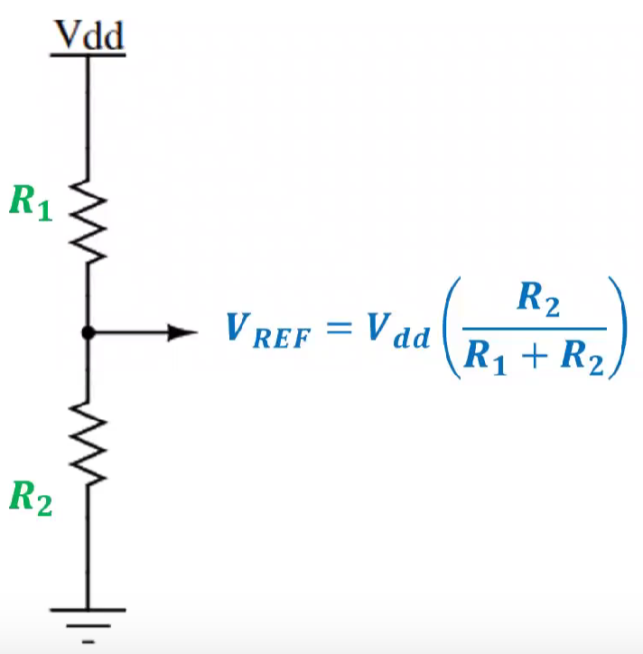
</p>
<p style="text-align:center; font-size:14px; color:#777;">
  Figure 2: Voltage Divider
</p>

The sensitivity of a reference voltage (Vref) to the supply voltage (VDD) describes how much Vref shifts when VDD varies. In a simple resistor-divider–based reference, this sensitivity is directly proportional to the supply voltage, meaning Vref tracks VDD rather than rejecting it. Because of this strong dependence on the supply, such a reference voltage is not suitable for precision applications or for powering LDOs, where stable, supply-independent reference voltages are essential.

### Forward-Biased PN Junction

A forward-biased PN junction is a diode with the P side positive and the N side negative, causing it to conduct current and exhibit a stable, predictable forward voltage drop.

A BJT (Bipolar Junction Transistor) can be used to create a forward-biased PN junction simply by connecting it in a diode configuration:

- Collector and base connected together
- Emitter acts as the other terminal

This turns the BJT into a diode with a predictable forward voltage drop, which can serve as a simple reference voltage (Vref).

<p align="center">
  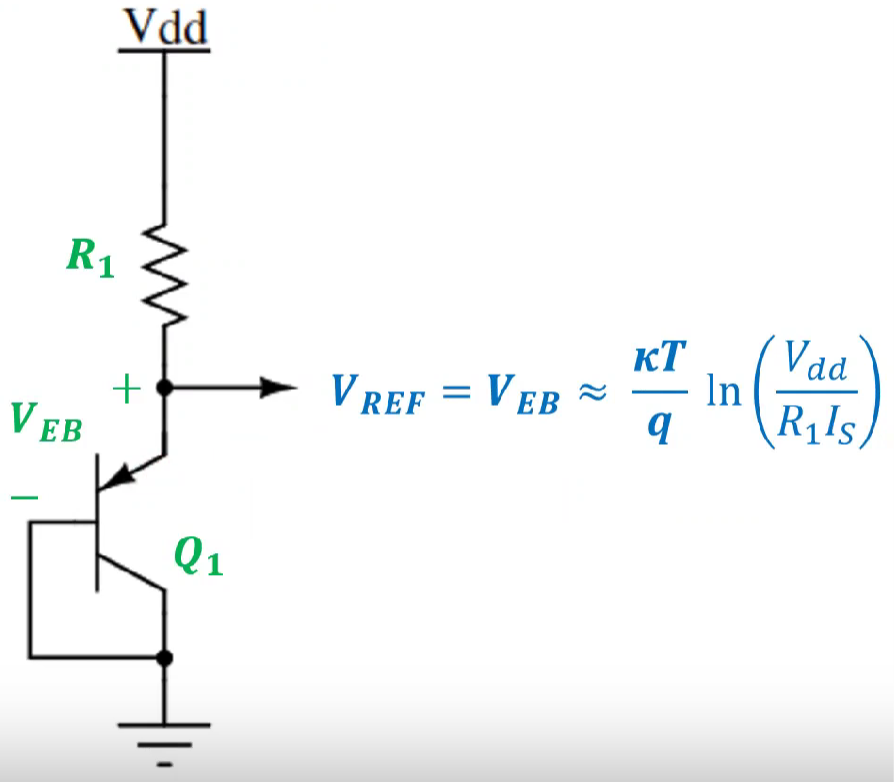
</p>
<p style="text-align:center; font-size:14px; color:#777;">
  Figure 3: Forward Biased PN Junction
</p>

The forward voltage has a negative temperature coefficient. This means the voltage decreases as temperature increases, which makes it unsuitable as a standalone precision reference. A forward-biased PN junction provides a simple, compact voltage reference, but due to its strong temperature dependence it is generally used as a building block—rather than the final reference—in precision circuits such as LDOs and ADCs.

### Base-Emitter Voltage-Referenced Circuit

One way to improve a simple forward-biased PN junction is to add a current mirror. This helps stabilize the current through the junction, which in turn reduces sensitivity to supply voltage variations (improves supply rejection).

However, the temperature coefficient of the junction remains high, because the forward voltage of a PN junction still decreases significantly with temperature. As a result, even with a current mirror, this configuration is not ideal for generating a precise, temperature-stable reference voltage (Vref).

<p align="center">
  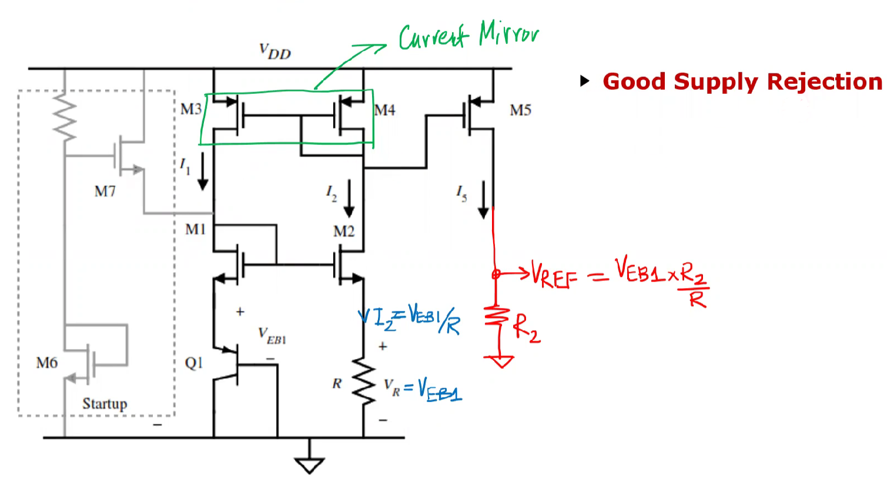
</p>
<p style="text-align:center; font-size:14px; color:#777;">
  Figure 4: Base-Emitter Voltage-Referenced Circuit
</p>

### Bandgap Reference (BGR)

This brings us to one of the important concepts in analog design—the bandgap reference circuit. This combines two voltages that behave in opposite ways with temperature, one is the voltage across a forward-biased PN junction, which drops as the temperature goes up and the other is the thermal voltage, which rises with temperature.

Individually, neither voltage is stable. But the idea of the bandgap reference lies in scaling and mixing them so that the increase in thermal voltage cancels the decrease in the PN-junction voltage. With the right balance, their temperature effects cancels each other resulting in temperature-independent reference voltage.

<p align="center">
  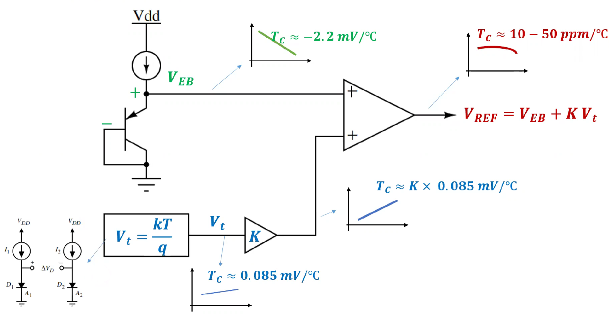
</p>
<p style="text-align:center; font-size:14px; color:#777;">
  Figure 5: Bandgap Reference
</p>

# Introduction

In almost every analog or mixed-signal circuit—like ADCs, DACs, PLLs, LDOs, and power management blocks there’s an important building block called the Bandgap Reference (BGR). Its main job is to provide a stable and accurate reference voltage that doesn’t change with manufacturing process, power supply variations, or temperature (PVT).

A typical bandgap reference outputs around 1.2 V, and what makes it special is that this voltage stays almost constant over a wide range of temperatures. Because of this stability, the BGR is considered the foundation for many precision analog systems.

## Applications

Bandgap references appear in almost every IC requiring precision or stability:

1. Voltage Regulators (LDOs, DC-DC Converters): Used as the internal reference voltage to set regulated output.
2. Analog-to-Digital Converters (ADCs): Defines the conversion range and ensures accurate digital output.
3. Digital-to-Analog Converters (DACs): Provides a stable voltage foundation for accurate analog output.
4. Biasing Circuits: Creates stable currents for amplifiers, op-amps, and sensor interfaces.

## Principle

A Bandgap Reference (BGR) is a fundamental analog circuit used to generate a stable and accurate reference voltage that remains nearly constant across temperature.
The diagram shows how a BGR works by combining two temperature-dependent voltages:

1. CTAT Voltage (Complementary-To-Absolute-Temperature): Decreases as temperature increases. Typically from a BJT’s base-emitter voltage. Negative slope vs temperature.

2. PTAT Voltage (Proportional-To-Absolute-Temperature): Increases as temperature increases. Typically generated from thermal source. Positive slope vs. temperature

The PTAT voltage is amplified by a gain K and then added to the CTAT voltage:

    VREF = VCTAT + K · VPTAT
    Where:
      VCTAT = (V<sub>BE</sub>)
      VPTAT = (V<sub>T</sub>)


<p align="center">
  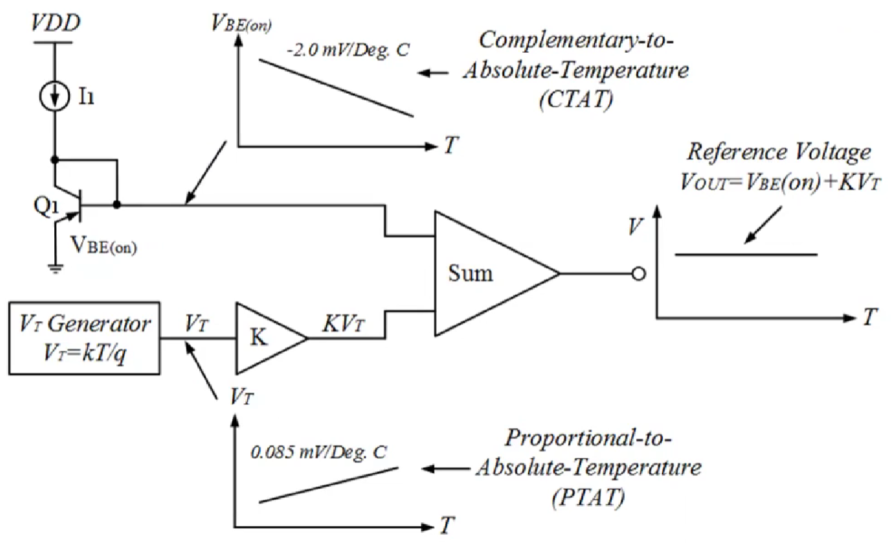
</p>
<p style="text-align:center; font-size:14px; color:#777;">
  Figure 6: Working
</p>


When the slopes are matched correctly, the opposite temperature dependencies cancel out, resulting in a temperature-independent reference voltage, typically around 1.2 V.

### BGR can be designed in two ways:

1. Using self-biased current mirror
    - Advantage:
      - simplest topology
      - Easy to design
      - Always stable
    - Limitations:
      - Low power supply rejection ratio (PSRR)
      - Cascode design needed to reduce PSRR
      - Voltage head-room issue
      - Need a start-up circuit
2. Using Operational-amplifier

###  Application-wise Bandgap Reference (BGR) Categorization:

1. Bandgap references (BGRs) are widely used in analog and mixed-signal circuits, but not all BGRs are designed the same. Depending on the application requirements, BGRs can be categorized as follows:
2. Low-voltage BGR – Optimized to operate with a minimal supply voltage, suitable for modern low-voltage digital systems.
3. Low-power BGR – Designed to consume very little current, making them ideal for battery-powered and portable devices.
4. High-PSRR and low-noise BGR – Offers excellent power supply rejection ratio (PSRR) and minimal output noise, critical for precision analog circuits.

Curvature-compensated BGR – Provides better temperature stability by compensating for the non-linear temperature behavior of the base-emitter voltage in transistors.

### BGR Components 

- CTAT (Complementary-to-Absolute-Temperature) voltage generation circuit
- PTAT (Proportional-to-Absolute-Temperature) voltage generation circuit
- Self biased current mirror circuit
- Refernence branch circuit
- Start up circuit

# CTAT Voltage Generation Circuit

There are two common ways to generate a voltage that decreases with temperature (a CTAT behavior). The diagram below shows how this can be done using either a diode or a BJT connected as a diode.

<p align="center">
  
</p>
<p style="text-align:center; font-size:14px; color:#777;">
  Figure 7: CTAT Voltage Generation Circuit
</p>

According to the principle, when a constant current flows through a diode, its forward voltage drops as temperature increases. This change is roughly –2 mV/°C. A BJT (PNP) used in diode-connected mode (base tied to collector) shows the same behavior, since its base-emitter voltage (V<sub>BE</sub>) also decreases with temperature.

## Reasons for Choosing a BJT Over a Diode

When using a simple diode structure, as shown in Figure 8(a), the anode is permanently tied to ground.
This becomes a problem because any forward-bias condition forces the substrate to be driven unintentionally, which can lead to latch-up, leakage, or complete circuit failure.
Since the anode is fixed at ground, it cannot properly track the required bias conditions of the circuit.

In Figure 8(b), if another p-well is added inside the n-well, a parasitic PNP BJT is formed.
When current flows from the p+ region into the n-well, this acts as base current, which then generates a collector current equal to β × I_B.
This collector current flows into the p-substrate (PSUB), which is undesirable because it injects charge into the substrate, causing noise, latch-up risk, and loss of current control.

To solve this issue, the structure in Figure 8(c) creates a controlled diode-connected NPN BJT:
- A p+ region is placed in the p-substrate, forming the collector.
- The n+ region serves as the base.
- Another p+ region inside the n-well becomes the emitter.

<p align="center">
  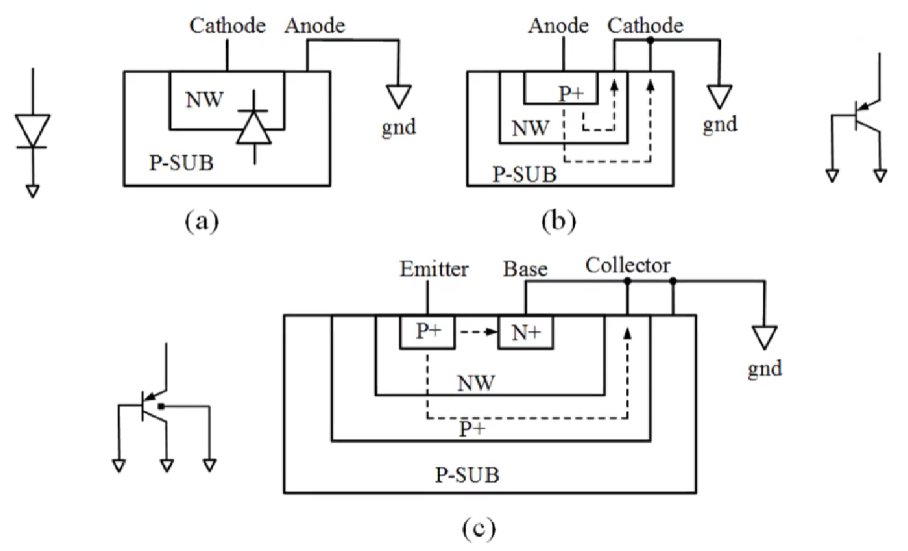
</p>
<p style="text-align:center; font-size:14px; color:#777;">
  Figure 8 (a): PN Diode (b): BJT (c) Diode connected BJT
</p>

In this configuration, any base current flowing from the p+ (emitter) to the n+ (base) produces a collector current of β × I<sub>B</sub>, but importantly, this collector current now flows through the dedicated p+ collector region, not through the global substrate.

Because the current path is well-defined, isolated, and predictable, the diode-connected NPN provides:
- stable current flow
- substrate isolation
- controlled β-scaled current

This is why a diode-connected NPN transistor is preferred over a simple diode or an uncontrolled parasitic BJT.

<p align="center">
  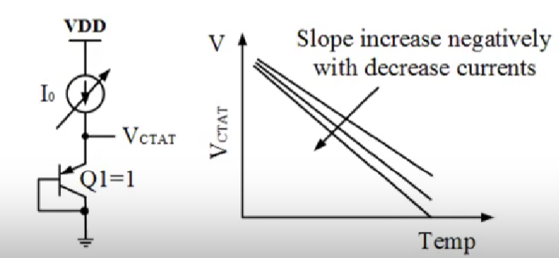
</p>
<p style="text-align:center; font-size:14px; color:#777;">
  Figure 9: Variation of Current 
</p>

Meaning of the annotation: “Slope increases negatively with decrease currents”

- Higher current → less negative slope (flatter line)
- Lower current → more negative slope (steeper line)

This matters for bandgap design, because adjusting current helps tune the CTAT slope so it can cancel with the PTAT term to produce a flat reference voltage.

# PTAT Voltage Generation Circuit

The circuit on the left is the core building block used to create a PTAT voltage—a voltage that increases linearly with temperature. This PTAT voltage will later be combined with a CTAT (V_BE) voltage to form a temperature-independent bandgap reference.

<p align="center">
  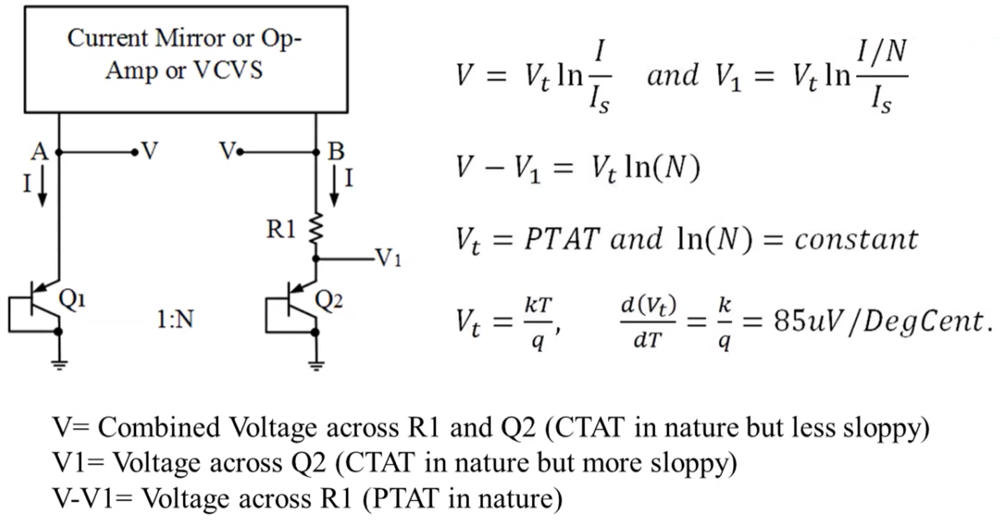
</p>
<p style="text-align:center; font-size:14px; color:#777;">
  Figure 10: PTAT Voltage Generation Circuit
</p>

The circuit on the left is the classic PTAT (Proportional-To-Absolute-Temperature) generator used inside a bandgap reference. It works by forcing the same current through two BJTs, Q1 and Q2, that have different emitter areas in a ratio of 1:N. Because both devices carry equal current, the smaller transistor (Q1) develops a larger V<sub>BE</sub>, while the larger transistor (Q2) develops a smaller V<sub>BE</sub>. The difference between these two base-emitter voltages, ΔV<sub>BE</sub>, is equal to V<sub>𝑡</sub> ln(N), where  V<sub>𝑡</sub> = 𝑘𝑇/𝑞 is the thermal voltage. Since V<sub>𝑡</sub> increases linearly with temperature, ΔV<sub>BE</sub> also increases with temperature, making it a PTAT voltage. The resistor R1 is placed so that this ΔV<sub>BE</sub> appears across it, generating a stable PTAT current or voltage. A current mirror or op-amp loop ensures both transistors carry identical current and keeps nodes A and B at equal voltage, stabilizing the operating point. This PTAT voltage is later combined with a CTAT V<sub>BE</sub> to create the temperature-independent bandgap reference.

<p align="center">
  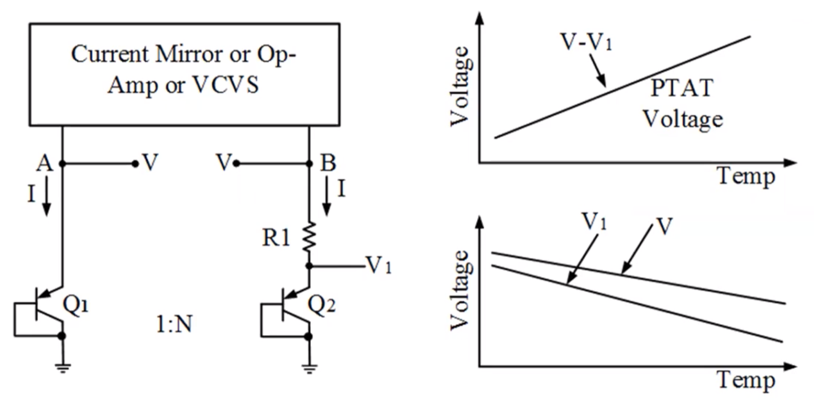
</p>
<p style="text-align:center; font-size:14px; color:#777;">
  Figure 11: PTAT Voltage Slope
</p>

The above two plots illustrate how different voltages in the PTAT generator behave with temperature. In the lower plot, the voltages V and V₁ both decrease as temperature increases because they are the base-emitter voltages of Q1 and Q2, which have a natural negative temperature coefficient (CTAT). Their slopes are slightly different since Q1 and Q2 have different emitter-area ratios, causing Q2’s V₁ to be smaller and less steep. The upper plot shows the difference between these two voltages, V − V₁, which produces a proportional-to-absolute-temperature (PTAT) voltage. This difference increases linearly with temperature because it is equal to ΔV_BE = Vₜ ln(N), and the thermal voltage Vₜ = kT/q increases with temperature. Thus, the lower graph visualizes the CTAT behavior of the two transistors individually, while the upper graph highlights their difference, which becomes a clean PTAT signal used in bandgap reference circuits.

## Design of Resistor R<sub>1</sub>

The value of R1 is determined mainly by the power consumption and available silicon area in the design. It follows the relation R1 = (Vt · ln N) / I, meaning that as the circuit current increases, the required resistance decreases, leading to a smaller area. Conversely, when the circuit current decreases, the resistance value must increase, consuming more area. Additionally, the resistance is influenced by the number of BJTs used in branch 2. For example, with a current of 10 µA and N = 8, the calculated value of R1 is approximately 5.4 kΩ.

# Self-Biased Current Mirror Circuit

A basic current mirror isn’t ideal for I<sub>REF</sub> generation, as its output is quite sensitive to changes in V<sub>DD</sub>. To achieve a stable reference current, the circuit’s bias should be derived from I<sub>OUT</sub> itself.

<p align="center">
  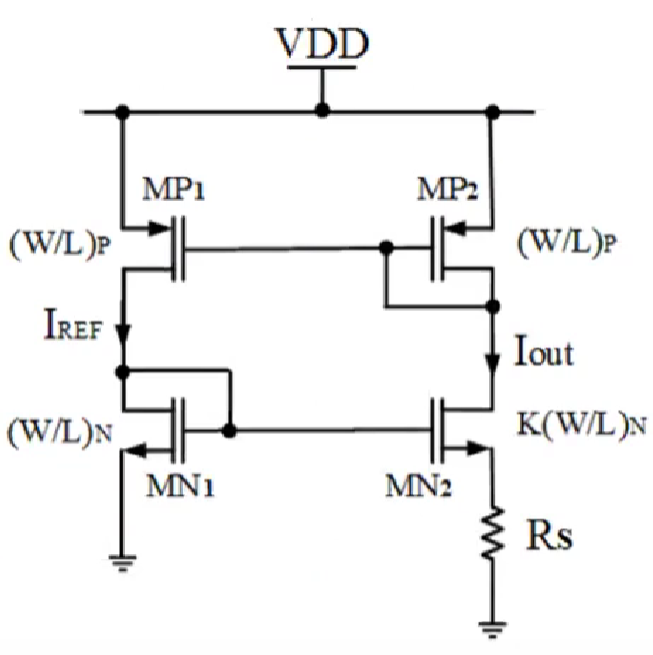
</p>
<p style="text-align:center; font-size:14px; color:#777;">
  Figure 12: Self-Biased Current Mirror
</p>

In a self-biased current mirror, the bias current is generated internally by the circuit itself, without relying on an external reference. This is typically achieved using transistor feedback loops, where one branch establishes the reference voltage or current, and the mirror branch replicates it. The circuit naturally adjusts until the voltages and currents reach a stable, desired value — a condition known as self-biasing equilibrium with loop gain always less than one. This eliminates the need for an external current source. This circuit is governed by on equation: I<sub>out</sub> = K × I<sub>REF</sub>, here, R<sub>s</sub> defines a unique current that is required for BGR. Both I<sub>out</sub> and I<sub>REF</sub> are very little dependent on VDD. However, this circuit suffers from start-up problem.

## Start-Up Problem in Self-Biasing Current Mirror Circuits for BGR

A self-biasing current mirror relies on internal feedback to establish the reference current. However, at power-up, the circuit can sometimes get stuck in a zero-current state, where no current flows through the transistors. This happens because, initially, all node voltages may be at levels that prevent the transistors from turning on, so the feedback loop cannot “kick-start” itself.

If the circuit doesn’t start, the Bandgap Reference (BGR) won’t generate the desired reference voltage, leading to incorrect operation. To solve this, designers usually include a start-up circuit, which briefly injects a small current into the mirror during power-up. Once the mirror begins conducting, the self-biasing feedback takes over, and the start-up circuit can be disconnected or becomes inactive.

In short, the start-up problem is about avoiding a zero-current lock at power-on and ensuring the BGR can reach its intended operating point reliably.

# Reference Branch Circuit

The reference branch is the core of a Bandgap Reference (BGR), responsible for combining CTAT (Complementary-to-Absolute-Temperature) and PTAT (Proportional-to-Absolute-Temperature) voltages to produce the required temperature-independent reference voltage. Typically, this branch includes a mirror transistor and a BJT configured as a diode. The mirror transistor ensures that the reference branch receives the same current as the current mirror branches, maintaining bias symmetry throughout the circuit.

<p align="center">
  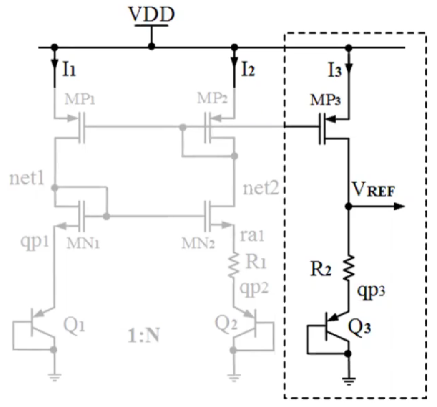
</p>
<p style="text-align:center; font-size:14px; color:#777;">
  Figure 13: Reference Branch Circuit (Dotted line)
</p>
A PTAT current from the PTAT generation circuit is mirrored into the reference branch, flowing through a resistor in series with the CTAT diode. Since the PTAT voltage slope is smaller than the CTAT voltage slope, the resistor value is chosen to scale the PTAT voltage appropriately. As a result, the total voltage across the resistor becomes the sum of the PTAT and CTAT components, producing a stable reference voltage that meets the required specifications.

The temperatue coefficient of Vref should be zero, since all the values are know alpha can be determined:

<p align="center">
  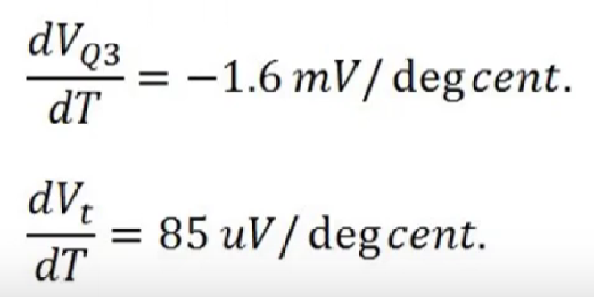
</p>
<p style="text-align:center; font-size:14px; color:#777;">
  Figure 14: Temperatue coefficients of CTAT and PTAT
</p>

<p align="center">
  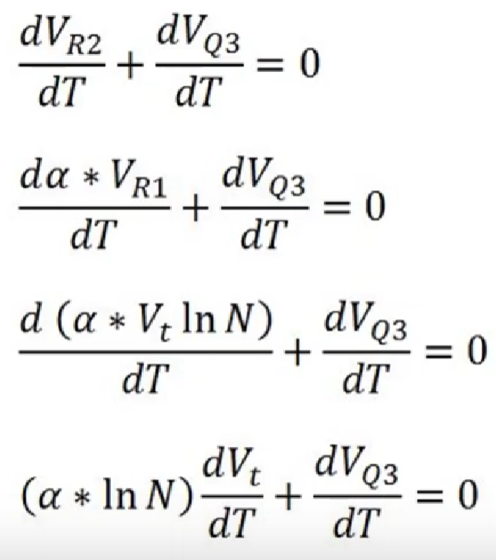
</p>
<p style="text-align:center; font-size:14px; color:#777;">
  Figure 15: Addition of CTAT and PTAT
</p>


# Start-Up Circuit

A startup circuit in a Bandgap Reference ensures that the self-biased current mirror begins conducting when power is applied. At power-up, a self-biased BGR can get stuck in a zero-current state, where none of the transistors are turned on, preventing the reference voltage from being established. The startup circuit solves this by injecting a small current into the mirror or bias network during the initial moments after power-on. This “kick-start” forces the transistors to turn on, allowing the feedback loop of the self-biased current mirror to take over. Once the reference current stabilizes and the BGR reaches its normal operating point, the startup circuit either turns off automatically or becomes negligible, leaving the BGR operating in a stable, self-sufficient state.

<p align="center">
  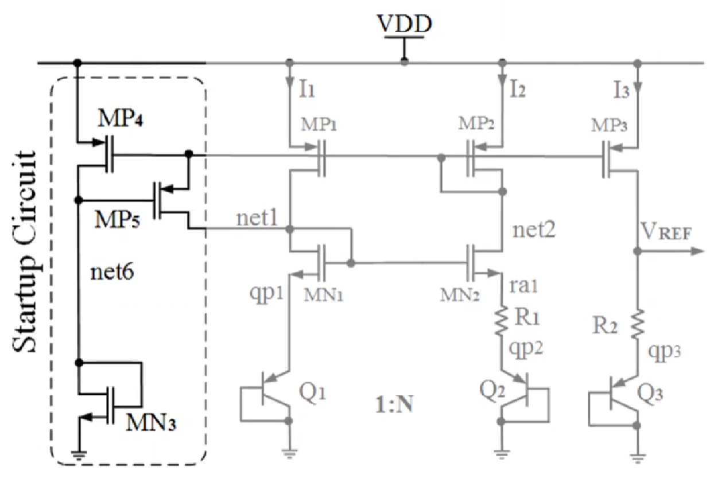
</p>
<p style="text-align:center; font-size:14px; color:#777;">
  Figure 16: Start-Up Circuit
</p>

# BGR Circuit

Figure 17 shows the complete Bandgap Reference (BGR) circuit, which is a combination of all the individual circuits discussed above.

<p align="center">
  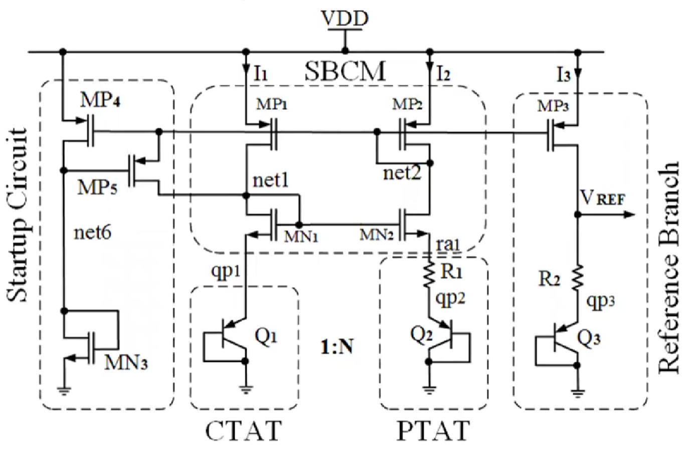
</p>
<p style="text-align:center; font-size:14px; color:#777;">
  Figure 17: BGR Circuit
</p>

The CTAT and PTAT voltages are carefully combined to produce a temperature-stable reference voltage. The current mirror ensures proper biasing across all branches, while the startup circuit guarantees reliable operation at power-up. Together, these elements form a complete Bandgap Reference, delivering a constant output voltage (~1.2 V) that remains stable despite changes in temperature, supply voltage, or load conditions.

# Lab Tools


https://github.com/vsdip/vsd-bandgap

## Design Specification

| Parameter | Specification |
|------------|----------------|
| Supply Voltage (VDD) | 1.8 V |
| Temperature Range | -40°C to 125°C |
| Power Consumption | < 60 µW |
| Off Current | < 2 µA |
| Start-up Time | < 2 µs |
| Temperature Coefficient (Tempco) of Vref | < 50 ppm/°C |

## Device Data Sheet

### MOSFET

| Parameter | NFET | PFET |
|------------|-------|-------|
| Type | LVT | LVT |
| Voltage Rating | 1.8 V | 1.8 V |
| Threshold Voltage (Vt0) | ~0.4 V | ~-0.6 V |
| Model | sky130_fd_pr__nfet_01v8_lvt | sky130_fd_pr__pfet_01v8_lvt |


### Bipolar Junction Transistor (PNP)

| Parameter | PNP |
|------------|------|
| Current Rating | 1 µA – 10 µA/µm² |
| Beta | ~12 |
| Area | 11.56 µm² |
| Model | sky130_fd_pr__pnp_05v5_W3p40l3p40 |


### Resistor (RPOLYH)

| Parameter | RPOLYH |
|------------|----------|
| Sheet Resistance | ~350 Ω |
| Tempco | 2.5 Ω/°C |
| Available Widths | 0.35 µm, 0.69 µm, 1.41 µm, 5.37 µm |
| Model | sky130_fd_pr__res_high_po |

## Circuit Design

### Step 1: Current Calculation

- Maximum Power Consumption = 60 µW  
- Supply Voltage = 1.8 V  
- Max Total Current = 60 µW / 1.8 V = 33.33 µA  
- Therefore, 10 µA per branch is chosen, (3 × 10 = 30 µA)  
- Start-up current = 1–2 µA  


### Step 2: Choosing Number of BJTs in Branch 2

- Lesser the BJTs, smaller resistance but poor matching.  
- Higher no. of BJTs, higher the resistance with good matching. 

Therefore,  **8 BJTs** in parallel for good matching and moderate resistance.


### Step 3: Calculation of R1

- R1 completely depends on the current flowing through the branch.

- R1 = (Vt × ln(8)) / I  
- R1 = (26 mV × ln(8)) / 10.7 µA ≈ 5 kΩ  

R1 Size:  
- W = 1.41 µm  
- L = 7.8 µm  
- Unit resistance = 2 kΩ  

Resistor implemented in 2 series and 2 in parallel (2 + 2 + (2‖2))

### Step 4: Calculation of R2

- Current through reference branch:  I3 = I2 = (Vt × ln(8)) / R1  

- Voltage across R2: VR2 = R2 × I3 = (R2 / R1) × (Vt × ln(8))  

- Slope of VR2 = (R2 / R1) × (ln(8) × 115 µV/°C)  
- Slope of VQ3 = -1.6 mV/°C  

For zero temperature coefficient,  Total slope = 0 → R2 ≈ 33 kΩ.  
Resistor implemented, 16 in series and 2 in parallel (2 + 2 + … + 2 + (2‖2)).

#### Step 5: Self-Biased Current Mirror (SBCM) Design

##### PMOS Design in SBCM

- MP1 and MP2 must operate in saturation region.  
- Reduce channel length modulation.  
- Final size, L = 2 µm, W = 5 µm, M = 4.  

#### NMOS Design in SBCM

- MN1 and MN2 can operate either in saturation or deep subthreshold region.  
- Here, they are designed to work in deep subthreshold region.  
- Increase channel length to improve stability.  
- Final size, L = 1 µm, W = 5 µm, M = 8.  

The figure below shows the sizing of all the fets and values for resistors based off of the design above.

<p align="center">
  
</p>
<p style="text-align:center; font-size:14px; color:#777;">
  Figure 19: BGR Circuit with Specs
</p>

# Component Design and Spice Netlist

## CTAT Spice Netlist
A CTAT-generation circuit was created in SPICE, and Figure 20 shows the corresponding SPICE netlist.

<p align="center">
  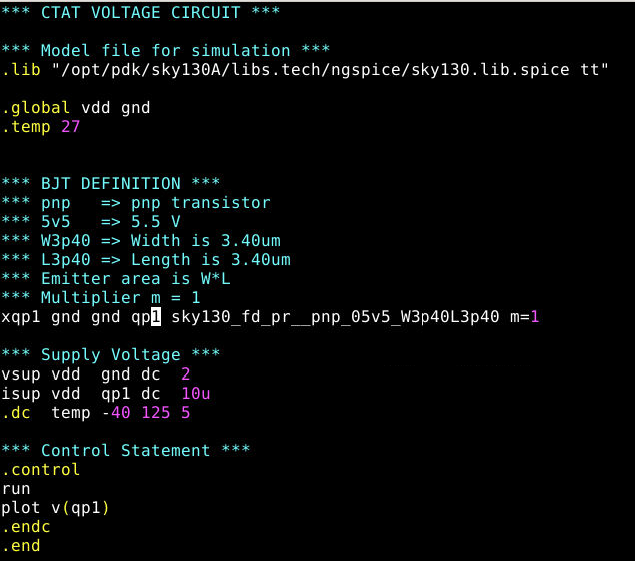
</p>
<p style="text-align:center; font-size:14px; color:#777;">
  Figure 20: CTAT Spice Netlist
</p>

After running the simulation, we obtain a plot of the voltage at node qp1. Figure 21 illustrates how this voltage changes with temperature.

<p align="center">
  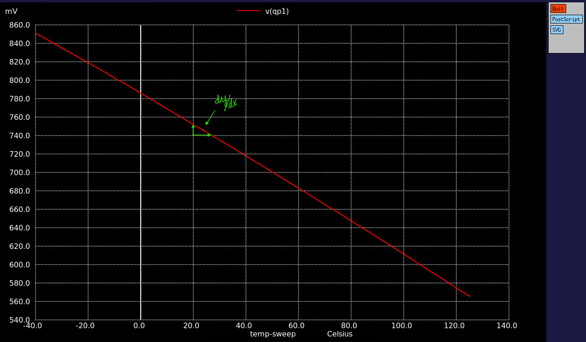
</p>
<p style="text-align:center; font-size:14px; color:#777;">
  Figure 21: V vs T Plot
</p>

The slope of the line is −1.71 mV/°C, which corresponds to approximately −2 mV of degradation per degree Celsius.

<p align="center">
  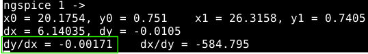
</p>
<p style="text-align:center; font-size:14px; color:#777;">
  Figure 22: Voltage Degradation
</p>

The modified code using multiple BJTs is shown below:

<p align="center">
  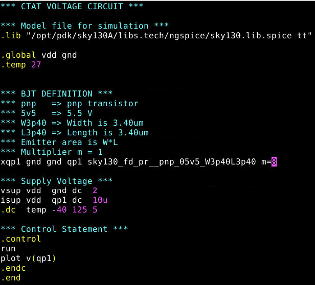
</p>
<p style="text-align:center; font-size:14px; color:#777;">
  Figure 23: CTAT Spice Netlist with 8 BJTs
</p>

Running the simulation plots the voltage at node qp1. Figure 24 shows the resulting voltage-versus-temperature curve.

<p align="center">
  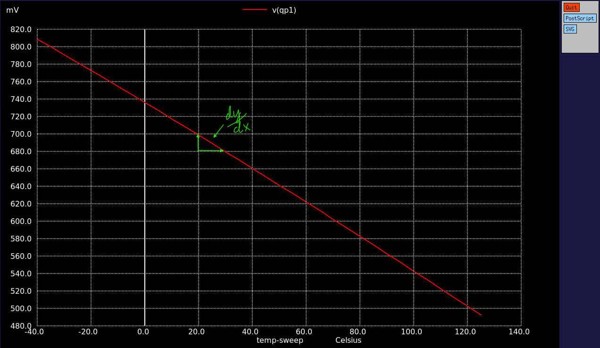
</p>
<p style="text-align:center; font-size:14px; color:#777;">
  Figure 24: V vs T Plot
</p>

The slope of the line is −1.93 mV/°C, which is even closer to the required −2 mV/°C degradation.

<p align="center">
  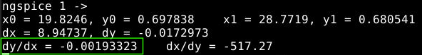
</p>
<p style="text-align:center; font-size:14px; color:#777;">
  Figure 25: Voltage Degradation
</p>

Next, we introduce variation to the current to observe its effect. The updated SPICE netlist is shown below.

<p align="center">
  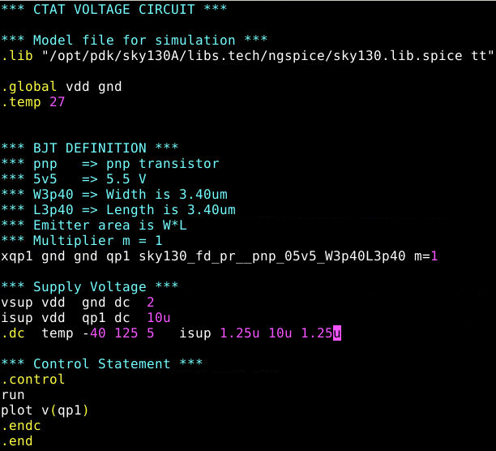
</p>
<p style="text-align:center; font-size:14px; color:#777;">
  Figure 26: CTAT Spice Netlist w Variable Currents
</p>

The Figure 27 below shows the plot generated from the above netlist.

<p align="center">
  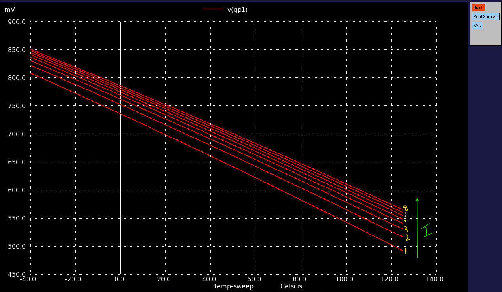
</p>
<p style="text-align:center; font-size:14px; color:#777;">
  Figure 27: V vs T Plot
</p>

As shown in Figure 27, the slope of the voltage-temperature curve flattens with increasing current. The following two figures—showing Line 1 and Line 8—further confirm this behavior.

<p align="center">
  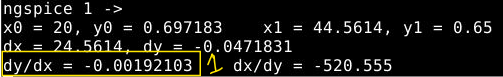
</p>
<p style="text-align:center; font-size:14px; color:#777;">
  Figure 28: Slope of Line 1 from Figure 26
</p>

<p align="center">
  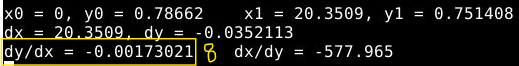
</p>
<p style="text-align:center; font-size:14px; color:#777;">
  Figure 29: Slope of Line 8 from Figure 26
</p>

## PTAT Spice Netlist

Figure 30 illustrates the PTAT circuit.

<p align="center">
  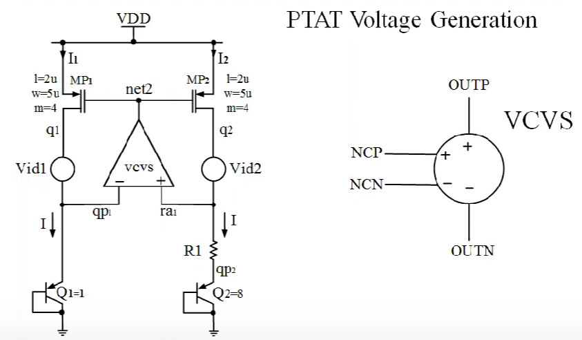
</p>
<p style="text-align:center; font-size:14px; color:#777;">
  Figure 30: PTAT Voltage Circuit
</p>

The spice netlist is below:

<p align="center">
  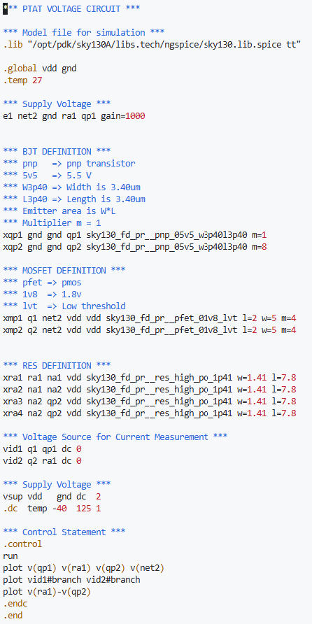
</p>
<p style="text-align:center; font-size:14px; color:#777;">
  Figure 31: PTAT Voltage Spice Netlist
</p>

PTAT plot are shown below:

<p align="center">
  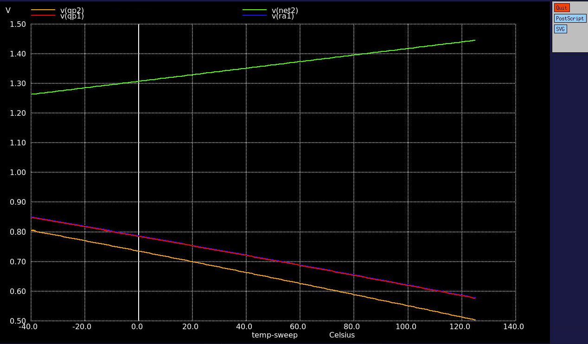
</p>
<p style="text-align:center; font-size:14px; color:#777;">
  Figure 32: PTAT Voltage Circuit Plot
</p>

The currents in branches Vd1 and Vd2 are equal, as expected.

<p align="center">
  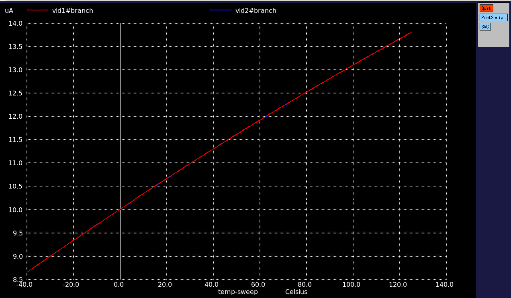
</p>
<p style="text-align:center; font-size:14px; color:#777;">
  Figure 33: Currents 
</p>

PTAT voltage increases with temperature as it can be seen in Figure 34.

<p align="center">
  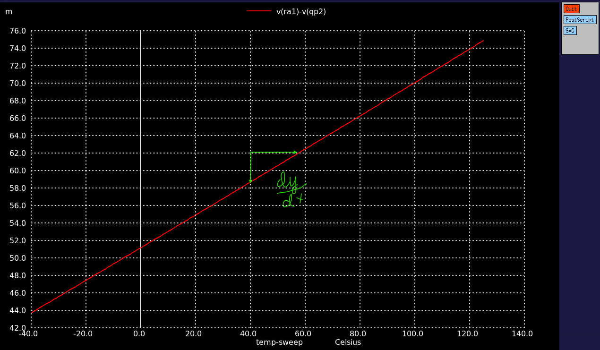
</p>
<p style="text-align:center; font-size:14px; color:#777;">
  Figure 34: PTAT Voltage
</p>

The measured slope of the PTAT line is 188.1 µV/°C, closely matching the expected value of 200 µV/°C.

<p align="center">
  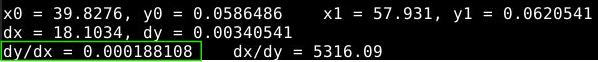
</p>
<p style="text-align:center; font-size:14px; color:#777;">
  Figure 35: PTAT Voltage Slope
</p>

A resistor with a positive temperature coefficient increases its resistance as the temperature rises. As a result, the voltage across the resistor also increases with temperature, producing a voltage that is proportional to absolute temperature (PTAT).

# BGR Using Ideal Op-Amp

Figure 36 shows the BGR circuit with an ideal op-amp. This implementation helps in understanding the design of the main branch, consisting of MP3, R2, and Q3.

<p align="center">
  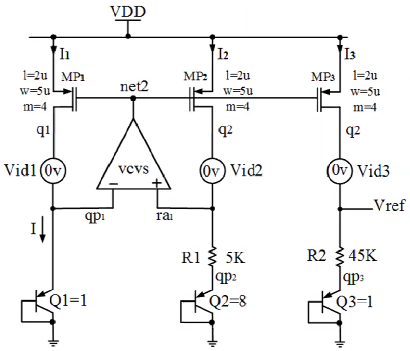
</p>
<p style="text-align:center; font-size:14px; color:#777;">
  Figure 36: BGR Using Ideal Op-Amp
</p>

The SPICE netlist for the circuit shown in Figure 36 is provided below.

```
*** BGR with OpAmp ***

.lib "/opt/pdk/sky130A/libs.tech/ngspice/sky130.lib.spice tt"

.global vdd gnd
.temp 27

*** VSVC DEFINITION ***
e1 net2 gnd ra1 qp1 gain=1000

*** MOS DEFINITION ***
xmp1    qp1     net2    vdd     vdd     sky130_fd_pr__pfet_01v8_lvt     l=2     w=5     m=4
xmp2    ra1     net2    vdd     vdd     sky130_fd_pr__pfet_01v8_lvt     l=2     w=5     m=4
xmp3    ref     net2    vdd     vdd     sky130_fd_pr__pfet_01v8_lvt     l=2     w=5     m=4

*** BJT DEFINITION ***
xqp1    gnd     gnd     qp1     sky130_fd_pr__pnp_05v5_W3p40L3p40       m=1
xqp2    gnd     gnd     qp2     sky130_fd_pr__pnp_05v5_W3p40L3p40       m=8
xqp3    gnd     gnd     qp3     sky130_fd_pr__pnp_05v5_W3p40L3p40       m=1

*** HIGH POLY RESISTANCE ***
*** R1 = 5K
*** Two 2K in series and two 2k in parallel
xra1    ra1     na1     vdd     sky130_fd_pr__res_high_po_1p41     w=1.41       l=7.8
xra2    na1     na2     vdd     sky130_fd_pr__res_high_po_1p41     w=1.41       l=7.8
xra3    na2     qp2     vdd     sky130_fd_pr__res_high_po_1p41     w=1.41       l=7.8
xra4    na2     qp2     vdd     sky130_fd_pr__res_high_po_1p41     w=1.41       l=7.8


*** R2 = 45K
*** 22 units of 2K in series resistance = 44K
*** Two 2k in parallel to result in 45K
xrb1    ref     nb1     vdd     sky130_fd_pr__res_high_po_1p41     w=1.41       l=7.8
xrb2    nb1     nb2     vdd     sky130_fd_pr__res_high_po_1p41     w=1.41       l=7.8
xrb3    nb2     nb3     vdd     sky130_fd_pr__res_high_po_1p41     w=1.41       l=7.8
xrb4    nb3     nb4     vdd     sky130_fd_pr__res_high_po_1p41     w=1.41       l=7.8
xrb5    nb4     nb5     vdd     sky130_fd_pr__res_high_po_1p41     w=1.41       l=7.8
xrb6    nb5     nb6     vdd     sky130_fd_pr__res_high_po_1p41     w=1.41       l=7.8
xrb7    nb6     nb7     vdd     sky130_fd_pr__res_high_po_1p41     w=1.41       l=7.8
xrb8    nb7     nb8     vdd     sky130_fd_pr__res_high_po_1p41     w=1.41       l=7.8
xrb9    nb8     nb9     vdd     sky130_fd_pr__res_high_po_1p41     w=1.41       l=7.8
xrb10   nb9     nb10    vdd     sky130_fd_pr__res_high_po_1p41     w=1.41       l=7.8
xrb11   nb10    nb11    vdd     sky130_fd_pr__res_high_po_1p41     w=1.41       l=7.8
xrb12   nb11    nb12    vdd     sky130_fd_pr__res_high_po_1p41     w=1.41       l=7.8
xrb13   nb12    nb13    vdd     sky130_fd_pr__res_high_po_1p41     w=1.41       l=7.8
xrb14   nb13    nb14    vdd     sky130_fd_pr__res_high_po_1p41     w=1.41       l=7.8
xrb15   nb14    nb15    vdd     sky130_fd_pr__res_high_po_1p41     w=1.41       l=7.8
xrb16   nb15    nb16    vdd     sky130_fd_pr__res_high_po_1p41     w=1.41       l=7.8
xrb17   nb16    nb17    vdd     sky130_fd_pr__res_high_po_1p41     w=1.41       l=7.8
xrb18   nb17    nb18    vdd     sky130_fd_pr__res_high_po_1p41     w=1.41       l=7.8
xrb19   nb18    nb19    vdd     sky130_fd_pr__res_high_po_1p41     w=1.41       l=7.8
xrb20   nb19    nb20    vdd     sky130_fd_pr__res_high_po_1p41     w=1.41       l=7.8
xrb21   nb20    nb21    vdd     sky130_fd_pr__res_high_po_1p41     w=1.41       l=7.8
xrb22   nb21    nb22    vdd     sky130_fd_pr__res_high_po_1p41     w=1.41       l=7.8
xrb23   nb22    qp3     vdd     sky130_fd_pr__res_high_po_1p41     w=1.41       l=7.8
xrb24   nb22    qp3     vdd     sky130_fd_pr__res_high_po_1p41     w=1.41       l=7.8


*** Voltage Source for Current Measument ***
vid1 q1 qp1  dc 0
vid2 q2 ra1  dc 0
vid3 q3 ref dc 0

*** SUPPLY VOLTAGE ***
vsup    vdd     gnd     dc      2
.dc     temp    -40     125     5

.control
run
plot v(vdd) v(qp1) v(ra1) v(qp2) v(ref) v(qp3)
plot vid1#branch vid2#branch vid3#branch
plot v(ref)

.endc
.end
```

The simulation plot is shown in Figure 37. The V<sub>REF</sub> value is approximately 1.2 V.

<p align="center">
  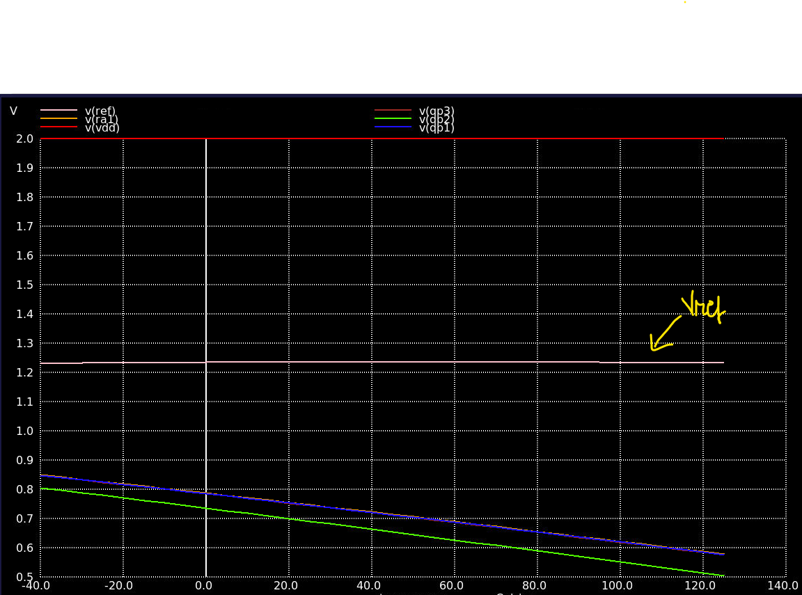
</p>
<p style="text-align:center; font-size:14px; color:#777;">
  Figure 36: BGR Using Ideal Op-Amp
</p>


When plotting only V<sub>REF</sub>, the curve resembles a bell shape, with the voltage ranging from approximately 1.230 V to 1.235 V.

<p align="center">
  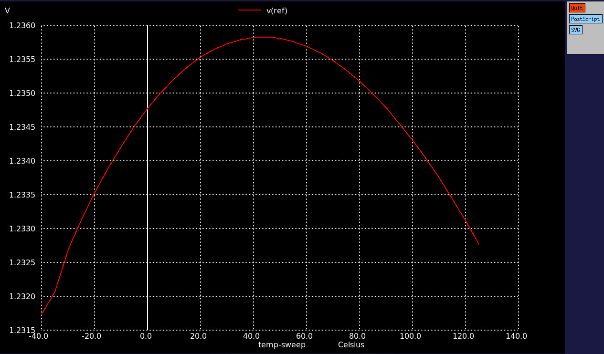
</p>
<p style="text-align:center; font-size:14px; color:#777;">
  Figure 38: BGR Using Ideal Op-Amp
</p>

The PTAT voltage can be obtained by plotting V<sub>REF</sub> − V(QP3). Figure 39 shows the resulting PTAT curve.

<p align="center">
  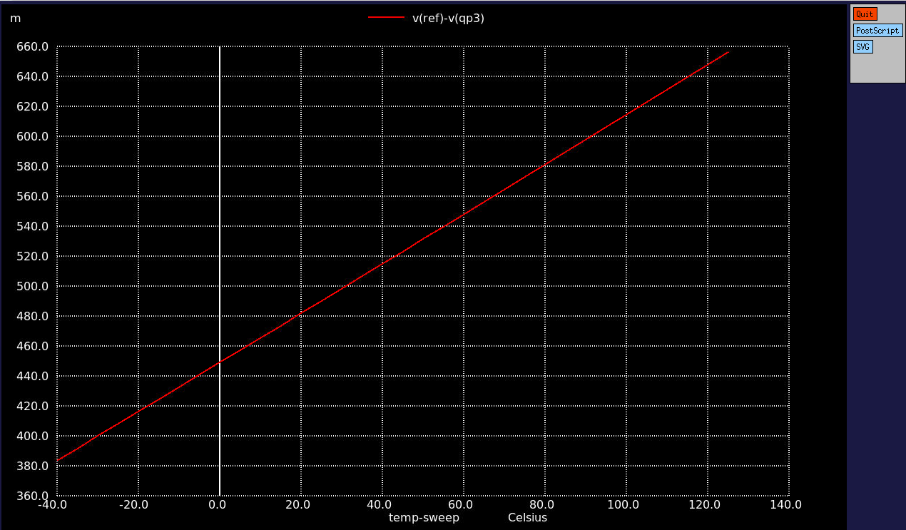
</p>
<p style="text-align:center; font-size:14px; color:#777;">
  Figure 39: PTAT Voltage
</p>

The slope of the PTAT line is 164.83uV.

<p align="center">
  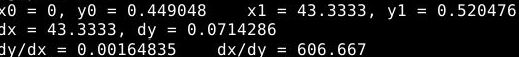
</p>
<p style="text-align:center; font-size:14px; color:#777;">
  Figure 40: PTAT Voltage
</p>

Figure 41 shows the CTAT curve, while Figure 42 illustrates its slope, which is 1.6 mV/°C.

<p align="center">
  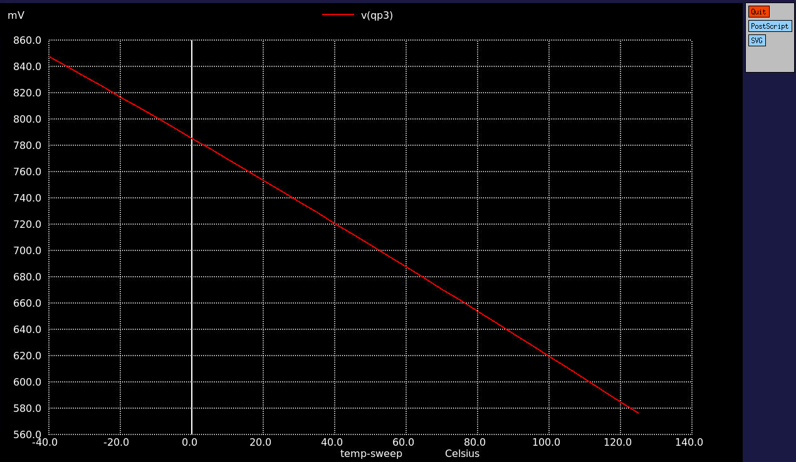
</p>
<p style="text-align:center; font-size:14px; color:#777;">
  Figure 41: CTAT Voltage
</p>

<p align="center">
  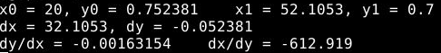
</p>
<p style="text-align:center; font-size:14px; color:#777;">
  Figure 42: CTAT Voltage Slope
</p>

Figure 43, shows CTAT in blue, PTAT in red and Vref voltage in Orange.

<p align="center">
  
</p>
<p style="text-align:center; font-size:14px; color:#777;">
  Figure 43: BGR Vref Voltage
</p>

# Self-Biased Current Mirror

<p align="center">
  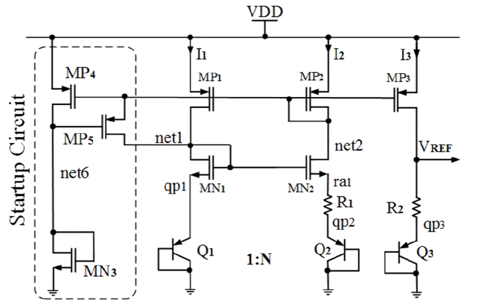
</p>
<p style="text-align:center; font-size:14px; color:#777;">
  Figure 44: BGR Vref Voltage
</p>

## Typical Corner

```
**** bandgap reference circuit using self-biase current mirror *****

.lib "/opt/pdk/sky130A/libs.tech/ngspice/sky130.lib.spice tt"

.global vdd gnd
.temp 27

*** circuit definition ***

*** mosfet definitions self-biased current mirror and output branch
xmp1    net1    net2    vdd     vdd     sky130_fd_pr__pfet_01v8_lvt     l=2     w=5     m=4
xmp2    net2    net2    vdd     vdd     sky130_fd_pr__pfet_01v8_lvt     l=2     w=5     m=4
xmp3    net3    net2    vdd     vdd     sky130_fd_pr__pfet_01v8_lvt     l=2     w=5     m=4
xmn1    net1    net1    q1      gnd     sky130_fd_pr__nfet_01v8_lvt     l=1     w=5     m=8
xmn2    net2    net1    q2      gnd     sky130_fd_pr__nfet_01v8_lvt     l=1     w=5     m=8

*** start-upcircuit
xmp4    net4    net2    vdd     vdd     sky130_fd_pr__pfet_01v8_lvt     l=2     w=5     m=1
xmp5    net5    net2    net4    vdd     sky130_fd_pr__pfet_01v8_lvt     l=2     w=5     m=1
xmp6    net7    net6    net2    vdd     sky130_fd_pr__pfet_01v8_lvt     l=2     w=5     m=2
xmn3    net6    net6    net8    gnd     sky130_fd_pr__nfet_01v8_lvt     l=7     w=1     m=1
xmn4    net8    net8    gnd     gnd     sky130_fd_pr__nfet_01v8_lvt     l=7     w=1     m=1

*** bjt definition
xqp1    gnd     gnd     qp1             sky130_fd_pr__pnp_05v5_W3p40L3p40       m=1
xqp2    gnd     gnd     qp2          sky130_fd_pr__pnp_05v5_W3p40L3p40       m=8
xqp3    gnd     gnd     qp3          sky130_fd_pr__pnp_05v5_W3p40L3p40       m=1

*** high-poly resistance definition
xra1    ra1     na1     vdd     sky130_fd_pr__res_high_po_1p41     w=1.41  l=7.8
xra2    na1     na2     vdd     sky130_fd_pr__res_high_po_1p41     w=1.41  l=7.8
xra3    na2     qp2     vdd     sky130_fd_pr__res_high_po_1p41     w=1.41  l=7.8
xra4    na2     qp2     vdd     sky130_fd_pr__res_high_po_1p41     w=1.41  l=7.8

xrb1    vref    nb1     vdd     sky130_fd_pr__res_high_po_1p41     w=1.41  l=7.8
xrb2    nb1     nb2     vdd     sky130_fd_pr__res_high_po_1p41     w=1.41  l=7.8
xrb3    nb2     nb3     vdd     sky130_fd_pr__res_high_po_1p41     w=1.41  l=7.8
xrb4    nb3     nb4     vdd     sky130_fd_pr__res_high_po_1p41     w=1.41  l=7.8
xrb5    nb4     nb5     vdd     sky130_fd_pr__res_high_po_1p41     w=1.41  l=7.8
xrb6    nb5     nb6     vdd     sky130_fd_pr__res_high_po_1p41     w=1.41  l=7.8
xrb7    nb6     nb7     vdd     sky130_fd_pr__res_high_po_1p41     w=1.41  l=7.8
xrb8    nb7     nb8     vdd     sky130_fd_pr__res_high_po_1p41     w=1.41  l=7.8
xrb9    nb8     nb9     vdd     sky130_fd_pr__res_high_po_1p41     w=1.41  l=7.8
xrb10   nb9     nb10    vdd     sky130_fd_pr__res_high_po_1p41     w=1.41  l=7.8
xrb11   nb10    nb11    vdd     sky130_fd_pr__res_high_po_1p41     w=1.41  l=7.8
xrb12   nb11    nb12    vdd     sky130_fd_pr__res_high_po_1p41     w=1.41  l=7.8
xrb13   nb12    nb13    vdd     sky130_fd_pr__res_high_po_1p41     w=1.41  l=7.8
xrb14   nb13    nb14    vdd     sky130_fd_pr__res_high_po_1p41     w=1.41  l=7.8
xrb15   nb14    nb15    vdd     sky130_fd_pr__res_high_po_1p41     w=1.41  l=7.8
xrb16   nb15    nb16    vdd     sky130_fd_pr__res_high_po_1p41     w=1.41  l=7.8
xrb17   nb16    qp3     vdd     sky130_fd_pr__res_high_po_1p41     w=1.41  l=7.8
xrb18   nb16    qp3     vdd     sky130_fd_pr__res_high_po_1p41     w=1.41  l=7.8

*** voltage source for current measurement
vid1    q1      qp1     dc      0
vid2    q2      ra1     dc      0
vid3    net3    vref    dc      0
vid4    net7    net1    dc      0
vid5    net5    net6    dc      0

*** supply voltage
vsup    vdd     gnd     dc      2
*.dc    vsup    0       3.3     0.3.3
.dc     temp    -40     125     5

*vsup   vdd     gnd     pulse   0       2       10n     1u      1u      1m      100u
*.tran  5n      10u
.control
run

plot v(vdd) v(net1) v(net2) v(qp1) v(ra1) v(qp2) v(vref) v(qp3)
plot vid1#branch vid2#branch vid3#branch vid4#branch vid5#branch

.endc
.end
```

<p align="center">
  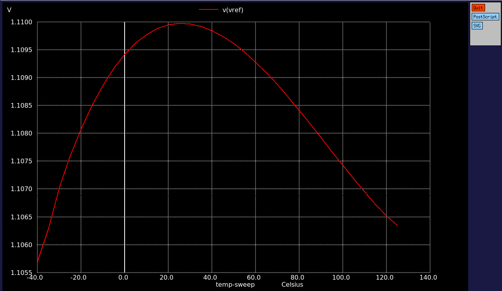
</p>
<p style="text-align:center; font-size:14px; color:#777;">
  Figure 45: BGR Vref Voltage for TT Corner
</p>

PPM Calculation = ((max Voltage - minmum voltage)/ nominal voltage)/temperature range = ((1.1100-1.1060)/1.1100)/165) = 21.84u

## SS Corner

```
**** bandgap reference circuit using self-biase current mirror at ss corner****

.lib "/opt/pdk/sky130A/libs.tech/ngspice/sky130.lib.spice ss"

.global vdd gnd
.temp 27

*** circuit definition ***

*** mosfet definitions self-biased current mirror and output branch
xmp1    net1    net2    vdd     vdd     sky130_fd_pr__pfet_01v8_lvt     l=2     w=5     m=4
xmp2    net2    net2    vdd     vdd     sky130_fd_pr__pfet_01v8_lvt     l=2     w=5     m=4
xmp3    net3    net2    vdd     vdd     sky130_fd_pr__pfet_01v8_lvt     l=2     w=5     m=4
xmn1    net1    net1    q1      gnd     sky130_fd_pr__nfet_01v8_lvt     l=1     w=5     m=8
xmn2    net2    net1    q2      gnd     sky130_fd_pr__nfet_01v8_lvt     l=1     w=5     m=8

*** start-upcircuit
xmp4    net4    net2    vdd     vdd     sky130_fd_pr__pfet_01v8_lvt     l=2     w=5     m=1
xmp5    net5    net2    net4    vdd     sky130_fd_pr__pfet_01v8_lvt     l=2     w=5     m=1
xmp6    net7    net6    net2    vdd     sky130_fd_pr__pfet_01v8_lvt     l=2     w=5     m=2
xmn3    net6    net6    net8    gnd     sky130_fd_pr__nfet_01v8_lvt     l=7     w=1     m=1
xmn4    net8    net8    gnd     gnd     sky130_fd_pr__nfet_01v8_lvt     l=7     w=1     m=1

*** bjt definition
xqp1    gnd     gnd     qp1             sky130_fd_pr__pnp_05v5_W3p40L3p40       m=1
xqp2    gnd     gnd     qp2          sky130_fd_pr__pnp_05v5_W3p40L3p40       m=8
xqp3    gnd     gnd     qp3          sky130_fd_pr__pnp_05v5_W3p40L3p40       m=1

*** high-poly resistance definition
xra1    ra1     na1     vdd     sky130_fd_pr__res_high_po_1p41     w=1.41  l=7.8
xra2    na1     na2     vdd     sky130_fd_pr__res_high_po_1p41     w=1.41  l=7.8
xra3    na2     qp2     vdd     sky130_fd_pr__res_high_po_1p41     w=1.41  l=7.8
xra4    na2     qp2     vdd     sky130_fd_pr__res_high_po_1p41     w=1.41  l=7.8

xrb1    vref    nb1     vdd     sky130_fd_pr__res_high_po_1p41     w=1.41  l=7.8
xrb2    nb1     nb2     vdd     sky130_fd_pr__res_high_po_1p41     w=1.41  l=7.8
xrb3    nb2     nb3     vdd     sky130_fd_pr__res_high_po_1p41     w=1.41  l=7.8
xrb4    nb3     nb4     vdd     sky130_fd_pr__res_high_po_1p41     w=1.41  l=7.8
xrb5    nb4     nb5     vdd     sky130_fd_pr__res_high_po_1p41     w=1.41  l=7.8
xrb6    nb5     nb6     vdd     sky130_fd_pr__res_high_po_1p41     w=1.41  l=7.8
xrb7    nb6     nb7     vdd     sky130_fd_pr__res_high_po_1p41     w=1.41  l=7.8
xrb8    nb7     nb8     vdd     sky130_fd_pr__res_high_po_1p41     w=1.41  l=7.8
xrb9    nb8     nb9     vdd     sky130_fd_pr__res_high_po_1p41     w=1.41  l=7.8
xrb10   nb9     nb10    vdd     sky130_fd_pr__res_high_po_1p41     w=1.41  l=7.8
xrb11   nb10    nb11    vdd     sky130_fd_pr__res_high_po_1p41     w=1.41  l=7.8
xrb12   nb11    nb12    vdd     sky130_fd_pr__res_high_po_1p41     w=1.41  l=7.8
xrb13   nb12    nb13    vdd     sky130_fd_pr__res_high_po_1p41     w=1.41  l=7.8
xrb14   nb13    nb14    vdd     sky130_fd_pr__res_high_po_1p41     w=1.41  l=7.8
xrb15   nb14    nb15    vdd     sky130_fd_pr__res_high_po_1p41     w=1.41  l=7.8
xrb16   nb15    nb16    vdd     sky130_fd_pr__res_high_po_1p41     w=1.41  l=7.8
xrb17   nb16    qp3     vdd     sky130_fd_pr__res_high_po_1p41     w=1.41  l=7.8
xrb18   nb16    qp3     vdd     sky130_fd_pr__res_high_po_1p41     w=1.41  l=7.8

*** voltage source for current measurement
vid1    q1      qp1     dc      0
vid2    q2      ra1     dc      0
vid3    net3    vref    dc      0
vid4    net7    net1    dc      0
vid5    net5    net6    dc      0

*** supply voltage
vsup    vdd     gnd     dc      2
*.dc    vsup    0       3.3     0.3.3
.dc     temp    -40     125     5

*vsup   vdd     gnd     pulse   0       2       10n     1u      1u      1m      100u
*.tran  5n      10u
.control
run

plot v(vdd) v(net1) v(net2) v(qp1) v(ra1) v(qp2) v(vref) v(qp3)
plot vid1#branch vid2#branch vid3#branch vid4#branch vid5#branch

.endc
.end
```

43 ppm
<p align="center">
  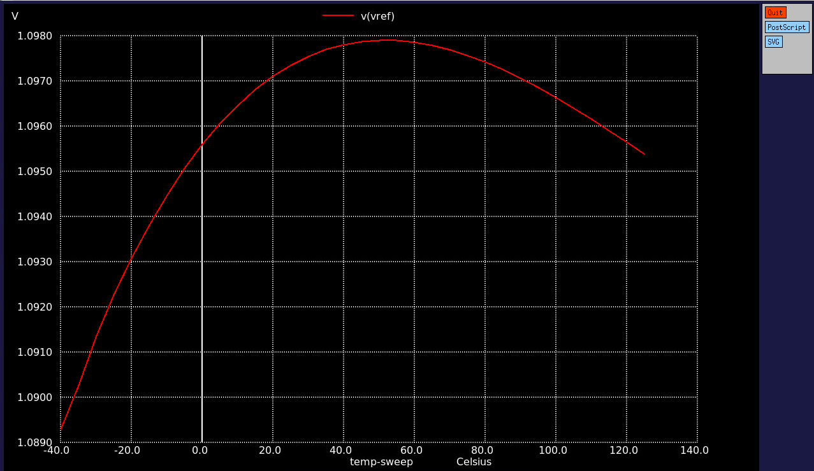
</p>
<p style="text-align:center; font-size:14px; color:#777;">
  Figure 46: BGR Vref Voltage for SS Corner
</p>

## FF Corner

```
**** bandgap reference circuit using self-biase current mirror at ff corner*****

.lib "/opt/pdk/sky130A/libs.tech/ngspice/sky130.lib.spice ff"

.global vdd gnd
.temp 27

*** circuit definition ***

*** mosfet definitions self-biased current mirror and output branch
xmp1    net1    net2    vdd     vdd     sky130_fd_pr__pfet_01v8_lvt     l=2     w=5     m=4
xmp2    net2    net2    vdd     vdd     sky130_fd_pr__pfet_01v8_lvt     l=2     w=5     m=4
xmp3    net3    net2    vdd     vdd     sky130_fd_pr__pfet_01v8_lvt     l=2     w=5     m=4
xmn1    net1    net1    q1      gnd     sky130_fd_pr__nfet_01v8_lvt     l=1     w=5     m=8
xmn2    net2    net1    q2      gnd     sky130_fd_pr__nfet_01v8_lvt     l=1     w=5     m=8

*** start-upcircuit
xmp4    net4    net2    vdd     vdd     sky130_fd_pr__pfet_01v8_lvt     l=2     w=5     m=1
xmp5    net5    net2    net4    vdd     sky130_fd_pr__pfet_01v8_lvt     l=2     w=5     m=1
xmp6    net7    net6    net2    vdd     sky130_fd_pr__pfet_01v8_lvt     l=2     w=5     m=2
xmn3    net6    net6    net8    gnd     sky130_fd_pr__nfet_01v8_lvt     l=7     w=1     m=1
xmn4    net8    net8    gnd     gnd     sky130_fd_pr__nfet_01v8_lvt     l=7     w=1     m=1

*** bjt definition
xqp1    gnd     gnd     qp1             sky130_fd_pr__pnp_05v5_W3p40L3p40       m=1
xqp2    gnd     gnd     qp2          sky130_fd_pr__pnp_05v5_W3p40L3p40       m=8
xqp3    gnd     gnd     qp3          sky130_fd_pr__pnp_05v5_W3p40L3p40       m=1

*** high-poly resistance definition
xra1    ra1     na1     vdd     sky130_fd_pr__res_high_po_1p41     w=1.41  l=7.8
xra2    na1     na2     vdd     sky130_fd_pr__res_high_po_1p41     w=1.41  l=7.8
xra3    na2     qp2     vdd     sky130_fd_pr__res_high_po_1p41     w=1.41  l=7.8
xra4    na2     qp2     vdd     sky130_fd_pr__res_high_po_1p41     w=1.41  l=7.8

xrb1    vref    nb1     vdd     sky130_fd_pr__res_high_po_1p41     w=1.41  l=7.8
xrb2    nb1     nb2     vdd     sky130_fd_pr__res_high_po_1p41     w=1.41  l=7.8
xrb3    nb2     nb3     vdd     sky130_fd_pr__res_high_po_1p41     w=1.41  l=7.8
xrb4    nb3     nb4     vdd     sky130_fd_pr__res_high_po_1p41     w=1.41  l=7.8
xrb5    nb4     nb5     vdd     sky130_fd_pr__res_high_po_1p41     w=1.41  l=7.8
xrb6    nb5     nb6     vdd     sky130_fd_pr__res_high_po_1p41     w=1.41  l=7.8
xrb7    nb6     nb7     vdd     sky130_fd_pr__res_high_po_1p41     w=1.41  l=7.8
xrb8    nb7     nb8     vdd     sky130_fd_pr__res_high_po_1p41     w=1.41  l=7.8
xrb9    nb8     nb9     vdd     sky130_fd_pr__res_high_po_1p41     w=1.41  l=7.8
xrb10   nb9     nb10    vdd     sky130_fd_pr__res_high_po_1p41     w=1.41  l=7.8
xrb11   nb10    nb11    vdd     sky130_fd_pr__res_high_po_1p41     w=1.41  l=7.8
xrb12   nb11    nb12    vdd     sky130_fd_pr__res_high_po_1p41     w=1.41  l=7.8
xrb13   nb12    nb13    vdd     sky130_fd_pr__res_high_po_1p41     w=1.41  l=7.8
xrb14   nb13    nb14    vdd     sky130_fd_pr__res_high_po_1p41     w=1.41  l=7.8
xrb15   nb14    nb15    vdd     sky130_fd_pr__res_high_po_1p41     w=1.41  l=7.8
xrb16   nb15    nb16    vdd     sky130_fd_pr__res_high_po_1p41     w=1.41  l=7.8
xrb17   nb16    qp3     vdd     sky130_fd_pr__res_high_po_1p41     w=1.41  l=7.8
xrb18   nb16    qp3     vdd     sky130_fd_pr__res_high_po_1p41     w=1.41  l=7.8

*** voltage source for current measurement
vid1    q1      qp1     dc      0
vid2    q2      ra1     dc      0
vid3    net3    vref    dc      0
vid4    net7    net1    dc      0
vid5    net5    net6    dc      0

*** supply voltage
vsup    vdd     gnd     dc      2
*.dc    vsup    0       3.3     0.3.3
.dc     temp    -40     125     5

*vsup   vdd     gnd     pulse   0       2       10n     1u      1u      1m      100u
*.tran  5n      10u
.control
run

plot v(vdd) v(net1) v(net2) v(qp1) v(ra1) v(qp2) v(vref) v(qp3)
plot vid1#branch vid2#branch vid3#branch vid4#branch vid5#branch

.endc
.end
```
<p align="center">
  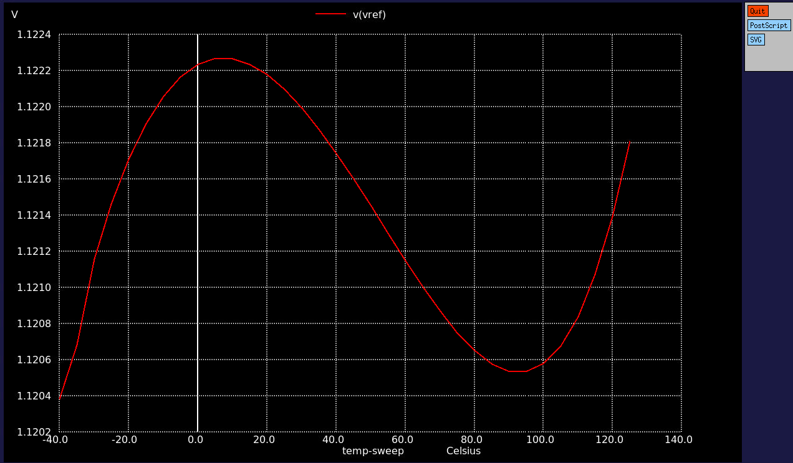
</p>
<p style="text-align:center; font-size:14px; color:#777;">
  Figure 47: BGR Vref Voltage for FF Corner
</p>

# Transient analysis to Understand Start Circuit 

Setting up transient analysis, Figure 48 plot the curves with the labels from the Figure 44.
```
**** bandgap reference circuit using self-biase current mirror *****

.lib "/opt/pdk/sky130A/libs.tech/ngspice/sky130.lib.spice tt"

.global vdd gnd
.temp 27

*** circuit definition ***

*** mosfet definitions self-biased current mirror and output branch
xmp1    net1    net2    vdd     vdd     sky130_fd_pr__pfet_01v8_lvt     l=2     w=5     m=4
xmp2    net2    net2    vdd     vdd     sky130_fd_pr__pfet_01v8_lvt     l=2     w=5     m=4
xmp3    net3    net2    vdd     vdd     sky130_fd_pr__pfet_01v8_lvt     l=2     w=5     m=4
xmn1    net1    net1    q1      gnd     sky130_fd_pr__nfet_01v8_lvt     l=1     w=5     m=8
xmn2    net2    net1    q2      gnd     sky130_fd_pr__nfet_01v8_lvt     l=1     w=5     m=8

*** start-upcircuit
xmp4    net4    net2    vdd     vdd     sky130_fd_pr__pfet_01v8_lvt     l=2     w=5     m=1
xmp5    net5    net2    net4    vdd     sky130_fd_pr__pfet_01v8_lvt     l=2     w=5     m=1
xmp6    net7    net6    net2    vdd     sky130_fd_pr__pfet_01v8_lvt     l=2     w=5     m=2
xmn3    net6    net6    net8    gnd     sky130_fd_pr__nfet_01v8_lvt     l=7     w=1     m=1
xmn4    net8    net8    gnd     gnd     sky130_fd_pr__nfet_01v8_lvt     l=7     w=1     m=1

*** bjt definition
xqp1    gnd     gnd     qp1             sky130_fd_pr__pnp_05v5_W3p40L3p40       m=1
xqp2    gnd     gnd     qp2          sky130_fd_pr__pnp_05v5_W3p40L3p40       m=8
xqp3    gnd     gnd     qp3          sky130_fd_pr__pnp_05v5_W3p40L3p40       m=1

*** high-poly resistance definition
xra1    ra1     na1     vdd     sky130_fd_pr__res_high_po_1p41     w=1.41  l=7.8
xra2    na1     na2     vdd     sky130_fd_pr__res_high_po_1p41     w=1.41  l=7.8
xra3    na2     qp2     vdd     sky130_fd_pr__res_high_po_1p41     w=1.41  l=7.8
xra4    na2     qp2     vdd     sky130_fd_pr__res_high_po_1p41     w=1.41  l=7.8

xrb1    vref    nb1     vdd     sky130_fd_pr__res_high_po_1p41     w=1.41  l=7.8
xrb2    nb1     nb2     vdd     sky130_fd_pr__res_high_po_1p41     w=1.41  l=7.8
xrb3    nb2     nb3     vdd     sky130_fd_pr__res_high_po_1p41     w=1.41  l=7.8
xrb4    nb3     nb4     vdd     sky130_fd_pr__res_high_po_1p41     w=1.41  l=7.8
xrb5    nb4     nb5     vdd     sky130_fd_pr__res_high_po_1p41     w=1.41  l=7.8
xrb6    nb5     nb6     vdd     sky130_fd_pr__res_high_po_1p41     w=1.41  l=7.8
xrb7    nb6     nb7     vdd     sky130_fd_pr__res_high_po_1p41     w=1.41  l=7.8
xrb8    nb7     nb8     vdd     sky130_fd_pr__res_high_po_1p41     w=1.41  l=7.8
xrb9    nb8     nb9     vdd     sky130_fd_pr__res_high_po_1p41     w=1.41  l=7.8
xrb10   nb9     nb10    vdd     sky130_fd_pr__res_high_po_1p41     w=1.41  l=7.8
xrb11   nb10    nb11    vdd     sky130_fd_pr__res_high_po_1p41     w=1.41  l=7.8
xrb12   nb11    nb12    vdd     sky130_fd_pr__res_high_po_1p41     w=1.41  l=7.8
xrb13   nb12    nb13    vdd     sky130_fd_pr__res_high_po_1p41     w=1.41  l=7.8
xrb14   nb13    nb14    vdd     sky130_fd_pr__res_high_po_1p41     w=1.41  l=7.8
xrb15   nb14    nb15    vdd     sky130_fd_pr__res_high_po_1p41     w=1.41  l=7.8
xrb16   nb15    nb16    vdd     sky130_fd_pr__res_high_po_1p41     w=1.41  l=7.8
xrb17   nb16    qp3     vdd     sky130_fd_pr__res_high_po_1p41     w=1.41  l=7.8
xrb18   nb16    qp3     vdd     sky130_fd_pr__res_high_po_1p41     w=1.41  l=7.8

*** voltage source for current measurement
vid1    q1      qp1     dc      0
vid2    q2      ra1     dc      0
vid3    net3    vref    dc      0
vid4    net7    net1    dc      0
vid5    net5    net6    dc      0

*** supply voltage
*vsup   vdd     gnd     dc      2
*.dc    vsup    0       3.3     0.3.3
*.dc    temp    -40     125     5

vsup    vdd     gnd     pulse   0       2       10n     1u      1u      1m      100u
.tran   5n      10u
.control
run

plot v(vdd) v(net1) v(net2) v(qp1) v(ra1) v(qp2) v(vref) v(qp3)
plot vid1#branch vid2#branch vid3#branch vid4#branch vid5#branch

.endc
.end
```

<p align="center">
  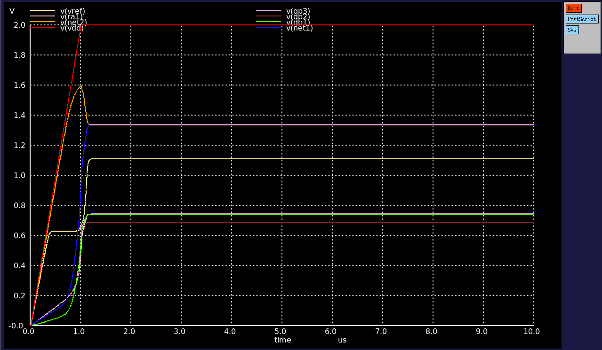
</p>
<p style="text-align:center; font-size:14px; color:#777;">
  Figure 48: BGR Vref Voltage for FF Corner
</p>

Observing the vref curver in yellow, it can be seen that 1.1us is taken for it to stabilize can be regarded as startup time.

# Layout Design

The layout of the submodules is shown below.

Command to open magic:

```
$magic -T {tech file path}
$magic -T /opt/pdk/sky130A/libs.tech/magic/sky130A.tech => this will open magic
```


## Resistor bank

<p align="center">
  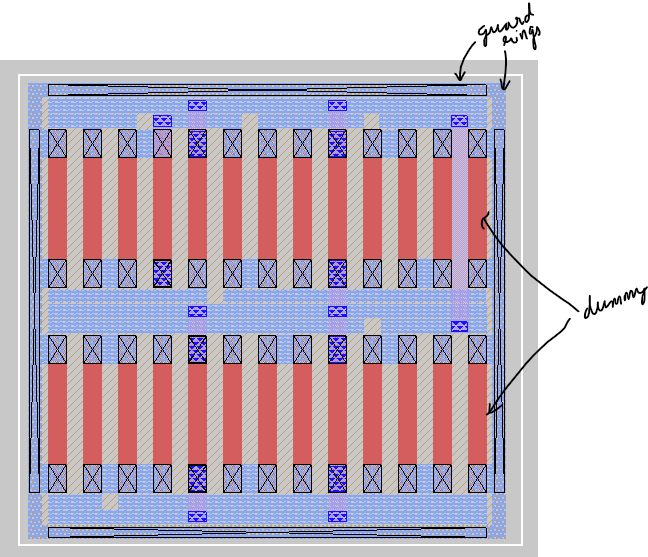
</p>
<p style="text-align:center; font-size:14px; color:#777;">
  Figure 49: Resistor bank
</p>

## PFETS

<p align="center">
  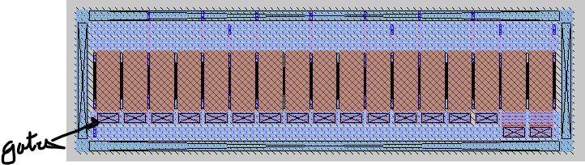
</p>
<p style="text-align:center; font-size:14px; color:#777;">
  Figure 50: PFETS
</p>

## NFETS

<p align="center">
  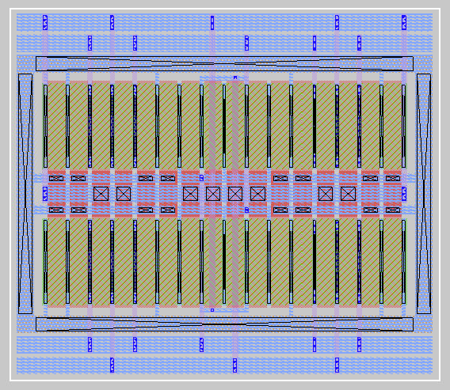
</p>
<p style="text-align:center; font-size:14px; color:#777;">
  Figure 51: NFETS
</p>

## TOP

<p align="center">
  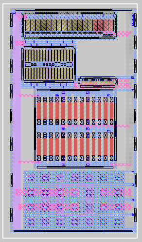
</p>
<p style="text-align:center; font-size:14px; color:#777;">
  Figure 52: Top Cell
</p>

Steps to perform extraction for individual components:

1. From Options select Cell Manager.

<p align="center">
  
</p>
<p style="text-align:center; font-size:14px; color:#777;">
  Figure 53: Magic
</p>

2. In the gui perform extraction for all the sub modules. 
- Select the sub module.
- Click on Load.
- In the tkcon window, excute the commands shown in Figure 55.

<p align="center">
  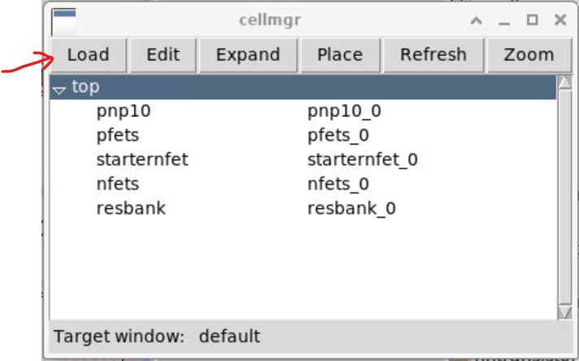
</p>
<p style="text-align:center; font-size:14px; color:#777;">
  Figure 54: Cell Manager
</p>

<p align="center">
  
</p>
<p style="text-align:center; font-size:14px; color:#777;">
  Figure 55: Commands
</p>


Example for Nfet.spice neltist.

<p align="center">
  
</p>
<p style="text-align:center; font-size:14px; color:#777;">
  Figure 56: Commands
</p>

Perform extraction for all the submodules and top cell.


# Lab Exercise

1. https://github.com/vsdip/vsd-bandgap/